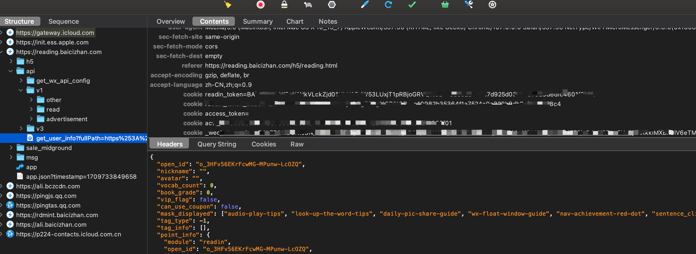

# Baicizhan Reading Crawler

薄荷阅读周刊书籍下载工具。

## 动机

薄荷阅读训练营需要完成全部阅读任务才可以回看对应的书籍，为了后续查看对应书籍，所以开发此脚本下载书籍内容于本地，方便后续查看。

## 使用方式

1. 拷贝本仓库 `git clone https://github.com/marmot-z/baicizhan-reading-crawler.git`
2. 进入目录 `cd ./baicizhan-reading-crawler`
3. 将自己的 token 填入 index.js 文件中
```js
const token = 'my-readin-token';
```
4. 运行脚本 `node index.js`

### token 的获取

在电脑或者手机上打开「薄荷阅读」公众号，打开 charles 等代理工具，找到 https://reading.baicizhan.com 网址 api 下的任意接口，拷贝请求中 readin_token cookie 值即可。


### 下载文件格式和阅读方式

导出来的文件格式如下：

```
bin
    |- 第x期训练营
        |- 书籍名称1
            |- 章节1
                |- index.html
            |- ...
            |- 章节n
            |- 书籍.md
        |- 书籍名称2
            |- ...
    |- 第XX期训练营
```

到处来的文件内容有两部分：
- 书籍各章节 html 文件
- 整书 Markdown 文件

点击各章节 index.html 文件即可阅读对应的内容。支持听音频文件，以及跳转章节。